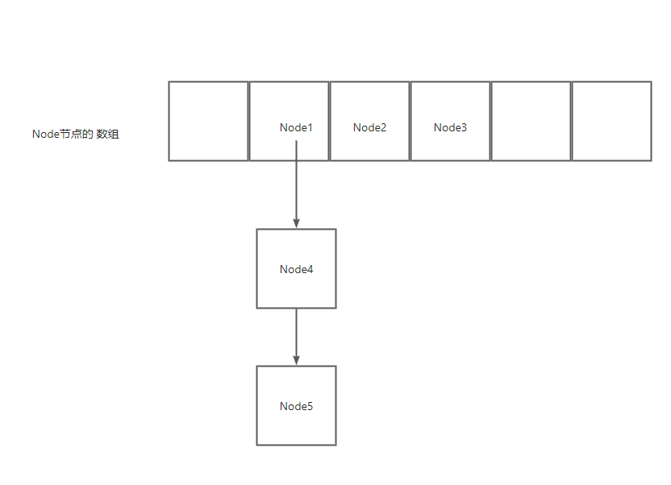
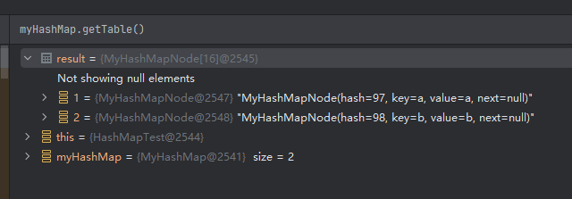
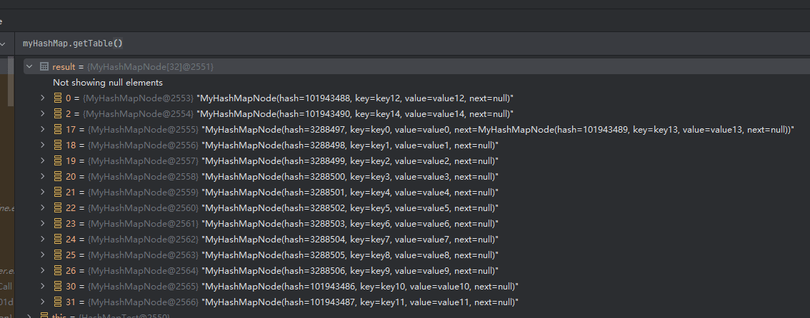

# 手把手带你写一个精简版 HashMap 的 put 方法

## 前言

HashMap 大家工作中遇到的太多了，已经成了必须使用的类了， 在面试的时候 HashMap 基本是必问题，但是很多同学只是打开看过原理，没有真正的去研究过。

里面是大佬写代码，为了性能和我们的业务代码写法差别很大，今天我带大家手写一个简单put 方法，保证用大家看得懂的代码来写。

## 最佳实践

### 直接上案例

案例地址GitHub： [https://github.com/zhuangjiaju/easytools/blob/main/easytools-test/src/test/java/com/github/zhuangjiaju/easytools/test/demo/hashmap/HashMapTest.java](https://github.com/zhuangjiaju/easytools/blob/main/easytools-test/src/test/java/com/github/zhuangjiaju/easytools/test/demo/hashmap/HashMapTest.java)

案例地址gitee： [https://gitee.com/zhuangjiaju/easytools/blob/main/easytools-test/src/test/java/com/github/zhuangjiaju/easytools/test/demo/hashmap/HashMapTest.java](https://gitee.com/zhuangjiaju/easytools/blob/main/easytools-test/src/test/java/com/github/zhuangjiaju/easytools/test/demo/hashmap/HashMapTest.java)

### HashMap 是什么样子的数组结构

首先一定要了解 HashMap 底层是一个数组，然后根据 key 的 HashCode 和 数组的长度 取余 ，放到指定的数组位置。 如果 HashCode 和
数组的长度 取余后的位置一样，则放到这个位置的链表中。



图片画的很明显，一个 Node 里面包含了 一个 key 和 value,放入 Node1 的时候假设放到了 1 号位置，Node2 放到 2 号位置，Node3 放到
3 号位置。

Node4的时候 HashCode 和 数组的长度 取余 也定位到了1 ，所以放到了 1 号位置 Node1的链表中。

Node5的时候 HashCode 和 数组的长度 取余 也定位到了1 ，所以也要 Node1的链表中，放到 Node4的后面。

### 接下来直接上源码

Node 节点，包含了 key 、 value、 next 、hash 4个字段。
key 和 value 就不多说了。
next 代表了下一个节点，为空则代表没有，有的话类似于上面说的Node3.
hash 实际上是 key 的 hash 值，为了减少次数，所以存储了起来。

```java
/**
 * HashMap 的 Node 节点
 *
 * @param <K>
 * @param <V>
 */
@Data
@SuperBuilder
@AllArgsConstructor
@NoArgsConstructor
public class MyHashMapNode<K, V> {
    /**
     * key 的hash 值
     */
    private int hash;
    /**
     * map 的key
     */
    private K key;
    /**
     * map 的value
     */
    private V value;
    /**
     * 下一个节点
     */
    private MyHashMapNode<K, V> next;
}

```

这一期我们仅仅展示 put 代码，其他代码我们后续实现。

核心逻辑就是通过 key 计算 hash 值，取模后定位到数组的列表，然后冲突了就放到链表里面。

最后，hash 取模以后经常冲突然后放到链表里面，需要判断超过 数组长度的75%就需要扩容到原来的2倍，确保尽可能少的用到链表。

```java

@Override
public V put(K key, V value) {
    // 为了简单期间不考虑 null
    // 放到table 数组的哪个位置 真正的hashmap 算法不一样 我们偷懒
    int hasCode = key.hashCode();
    int index = hasCode % table.length;
    // 我们找到了我们需要放的位置
    MyHashMapNode<K, V> node = table[index];
    // 这个位置没有数据 我们直接放进去即可 非常轻松
    if (node == null) {
        table[index] = MyHashMapNode.<K, V>builder()
            .hash(hasCode)
            .key(key)
            .value(value)
            .build();
    } else {
        // 已经有了 我们要放到最后一个node 的最后,所以需要一个个node 的遍历
        // 真正的HashMap 还会转红黑树，我们就么必要了
        MyHashMapNode<K, V> nextNode = node;
        while (true) {
            // 先判断 hash值是否一样 为了提高性能 无所谓性能可以直接比较 key 是否一样
            // 如果找到了key 一样 我们把他替换掉 然后退出
            if (nextNode.getHash() == hasCode && nextNode.getKey().equals(key)) {
                // key 一样 我们直接替换
                nextNode.setValue(value);
                break;
            }

            // 如果没有下一个节点了 我们直接放到最后一个节点
            if (nextNode.getNext() == null) {
                nextNode.setNext(MyHashMapNode.<K, V>builder()
                    .hash(hasCode)
                    .key(key)
                    .value(value)
                    .build());
                break;
            }
            // 不为空 则继续往后找
            nextNode = nextNode.getNext();
        }

    }

    // 尝试重新扩容 当table 存储超过75%的时候 我们需要重新扩容，确保每次key 计算hash 值能直接命中，而不需要一个比较过去
    if (size > table.length * 0.75) {
        // 直接扩容成2倍
        MyHashMapNode<K, V>[] newTable = new MyHashMapNode[table.length * 2];
        // 遍历所有旧的数据
        // 所有的子节点都要迭代掉
        for (MyHashMapNode<K, V> oldNode : table) {
            // 空数据不管
            if (oldNode == null) {
                continue;
            }
            // 旧的下一个节点
            MyHashMapNode<K, V> oldNodeNext = oldNode;

            // 这里核心是把数组+链表所有的数据都迭代出来
            while (true) {
                // 直接获取下一个节点 这里要提早获取 以为要要把 oldNode的next 设置成null
                oldNodeNext = oldNodeNext.getNext();

                // 清空下一个节点 因为要重新挂到新的table 上 重新挂的时候会有新的next
                oldNode.setNext(null);

                // 重新计算数组下标
                int newIndex = oldNode.getHash() % newTable.length;
                MyHashMapNode<K, V> newNode = newTable[newIndex];
                // 这个位置没有数据 我们直接放进去即可
                if (newNode == null) {
                    newTable[newIndex] = oldNode;
                } else {
                    // 已经有了 我们要放到最后一个node 的最后,所以需要一个个node 的遍历
                    // 真正的HashMap 还会转红黑树，我们就么必要了
                    MyHashMapNode<K, V> newNextNode = newNode;
                    while (true) {
                        // 如果没有下一个节点了 我们直接放到最后一个节点
                        if (newNextNode.getNext() == null) {
                            newNextNode.setNext(MyHashMapNode.<K, V>builder()
                                .hash(hasCode)
                                .key(key)
                                .value(value)
                                .build());
                            break;
                        }
                        // 不为空 则继续往后找
                        newNextNode = newNextNode.getNext();
                    }
                }

                // 最后一个节点了 结束循环
                if (oldNodeNext == null) {
                    break;
                }
            }
        }
        // 替换旧的table
        table = newTable;
    }
    // 条数加+1
    size++;
    return value;
}

```

以上代码虽然不多，但是完成了 HashMap put方法的核心逻辑，非常建议大家花时间仔细研究下，这样后面再也没有人通过 HashMap 问倒你了。

### 测试下效果

```java
    /**
 * 侧测试我们自己写的HashMap
 * 在里面放2个值 看看效果
 */
@Test
public void putTest() throws Exception {
    MyHashMap<String, String> myHashMap = new MyHashMap<>();
    myHashMap.put("a", "a");
    myHashMap.put("b", "b");

    log.info("放置后的数组:{}", JSON.toJSONString(myHashMap.getTable()));
    Assertions.assertEquals(2, myHashMap.getSize());

    // 迭代所有节点
    for (MyHashMapNode<String, String> node : myHashMap.getTable()) {
        if (node == null) {
            continue;
        }
        Assertions.assertTrue(StringUtils.equalsAny(node.getKey(), "a", "b"));
        Assertions.assertTrue(StringUtils.equalsAny(node.getValue(), "a", "b"));
    }
}

```

输出结果：

```text
放置后的数组:[null,{"hash":97,"key":"a","value":"a"},{"hash":98,"key":"b","value":"b"},null,null,null,null,null,null,null,null,null,null,null,null,null]
```

贴一张图更加的明显

其中空的数组没有展示出来，只有数组的 1、2 放置了2个数据。


### 测试我们的扩容代码

我们放15个值 看看效果，会触发一次扩容

```java
    /**
 * 测试扩容的代码
 * 我们放15个值 看看效果，会触发一次扩容
 */
@Test
public void resizeTest() throws Exception {
    MyHashMap<String, String> myHashMap = new MyHashMap<>();
    // 放入15条 理论上来扩容过一次
    for (int i = 0; i < 15; i++) {
        myHashMap.put("key" + i, "value" + i);
    }
    log.info("放置后的数组:{}", JSON.toJSONString(myHashMap.getTable()));
    Assertions.assertEquals(15, myHashMap.getSize());
    Assertions.assertEquals(32, myHashMap.getTable().length);
}
```

直接贴输出的图

可以看到我们的15条数据还是非常散列的，只有在17的位置产生了链表，这样子在查的速度会非常快，几乎就是O(1)。

实际工作中的 HashMap 存储也查不到，几乎可以理解成 HashMap 就是O(1)。


### 总结

今天带着大家了手写了 HashMap 的 put方法，大家是不是感觉 HashMap 原来可以这么简单，看过还需要自己去试一下哟。

下一节会给大家介绍 HashMap 的 get 方法，大家敬请期待。

## 写在最后

给大家推荐一个非常完整的Java项目搭建的最佳实践,也是本文的源码出处，由大厂程序员&EasyExcel作者维护。   
github地址：[https://github.com/zhuangjiaju/easytools](https://github.com/zhuangjiaju/easytools)   
gitee地址：[https://gitee.com/zhuangjiaju/easytools](https://gitee.com/zhuangjiaju/easytools)
