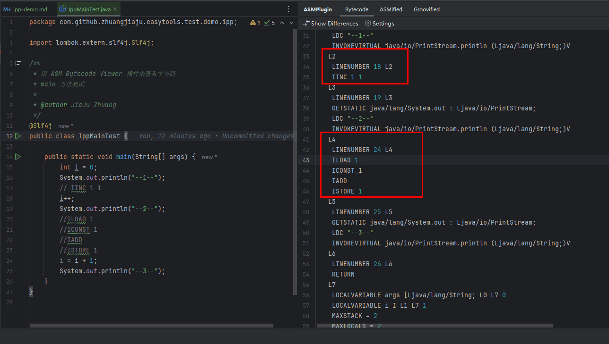

# java 中 i++ 到底是否线程安全？

## 前言

大家在写代码中 `i++` 经常用到，那大家是否知道他是否安全的？更进一步的问为什么呢？

今天我们就一起深入研究中 `i++`。通过这个文章你会了解以下知识点：

* 为什么 `i++` 是线程不安全的？
* 为什么 `AtomicInteger` 是线程安全的？
* `AtomicInteger` 的源码解读

## 最佳实践

### 直接上案例

案例地址GitHub： [https://github.com/zhuangjiaju/easytools/blob/main/easytools-source-code/java21/src/main/java/java/util/concurrent/atomic/AtomicInteger.java](https://github.com/zhuangjiaju/easytools/blob/main/easytools-source-code/java21/src/main/java/java/util/concurrent/atomic/AtomicInteger.java)

案例地址gitee： [https://gitee.com/zhuangjiaju/easytools/blob/main/easytools-source-code/java21/src/main/java/java/util/concurrent/atomic/AtomicInteger.java](https://gitee.com/zhuangjiaju/easytools/blob/main/easytools-source-code/java21/src/main/java/java/util/concurrent/atomic/AtomicInteger.java)

### 先测试下 i++ 是否安全

用100个线程，每个线程支持 10000 次 i++。

```java
/**
 * 用户 100个虚拟线程
 * 给 i 做一万次 i++
 */
@Test
public void demo() throws Exception {
    i = 0;
    // 用来等待所有线程执行完毕
    CountDownLatch countDownLatch = new CountDownLatch(100);
    for (int j = 0; j < 100; j++) {
        // 启动虚拟线程 性能比线程好
        Thread.startVirtualThread(() -> {
            for (int k = 0; k < 10000; k++) {
                i++;
            }
            countDownLatch.countDown();
        });
    }
    // 等待所有线程执行完毕
    countDownLatch.await();
    // 如果线程安全 则会输出 1000000，实际上会小于 1000000
    log.info("结果是：{}", i);
    Assertions.assertTrue(i < 1000000);
}
```

输出结果：

```text
 结果是：78382
```

最终看到 只是输出了 78382 ，小于我们期望的 1000000，可见 i++ 是线程不安全的。

那怎么才能线程安全呢？

### 用 synchronized 加锁实现线程安全

很多同学也想到了用 synchronized 加锁实现线程安全，对的加完锁，我们就实现了线程安全。

```java
/**
 * 用户 100个虚拟线程
 * 给 i 做一万次 i++
 * 加上synchronized 锁
 */
@Test
public void threadSafeSynchronized() throws Exception {
    i = 0;
    // 用来等待所有线程执行完毕
    CountDownLatch countDownLatch = new CountDownLatch(100);
    for (int j = 0; j < 100; j++) {
        // 启动虚拟线程 性能比线程好
        Thread.startVirtualThread(() -> {
            for (int k = 0; k < 10000; k++) {
                synchronized (IppTest.class) {
                    i++;
                }
            }
            countDownLatch.countDown();
        });
    }
    // 等待所有线程执行完毕
    countDownLatch.await();
    // 加了锁以后可以正常的输出 1000000
    log.info("结果是：{}", i);
    Assertions.assertEquals(1000000, i);
}
```

输出结果：

```text
结果是：1000000
```

synchronized 实际上对每一个操作都加了锁，所以性能不太好，其他还有什么更好的办法呢？

### 用 AtomicInteger 来 实现 i++ 线程安全

jdk 自带的一个类 AtomicInteger 专门为我们这种情况提供的，上源码：

```java
    /**
 * 用户 100个虚拟线程
 * 给 atomicInteger 做一万次 累加
 */
@Test
public void threadSafeAtomicInteger() throws Exception {
    atomicInteger = new AtomicInteger(0);
    // 用来等待所有线程执行完毕
    CountDownLatch countDownLatch = new CountDownLatch(100);
    for (int j = 0; j < 100; j++) {
        // 启动虚拟线程 性能比线程好
        Thread.startVirtualThread(() -> {
            for (int k = 0; k < 10000; k++) {
                atomicInteger.incrementAndGet();
            }
            countDownLatch.countDown();
        });
    }
    // 等待所有线程执行完毕
    countDownLatch.await();
    // 加了锁以后可以正常的输出 1000000
    log.info("结果是：{}", atomicInteger.get());
    Assertions.assertEquals(1000000, atomicInteger.get());
}
```

输出结果：

```text
结果是：1000000
```

### i++ 为什么是线程不全的呢？

首先给我们的编辑器`IntelliJ IDEA` 安装一个插件 `ASM Bytecode Viewer` 专门用来看直接码的。

然后我们写一个简单的代码：

```java
    public static void main(String[] args) {
    int i = 0;
    System.out.println("--1--");
    // IINC 1 1  将指定int型变量增加指定值 线程不安全
    i++;
    System.out.println("--2--");
    //ILOAD 1 将指定的int型本地变量推送至栈顶	
    //ICONST_1 将int型1推送至栈顶	
    //IADD 将栈顶两int型数值相加并将结果压入栈顶	
    //ISTORE 1 	将栈顶int型数值存入指定本地变量
    i = i + 1;
    System.out.println("--3--");
}
```

右键 `ASM Bytecode Viewer` 我们可以看到对对应的字节码了：



红色框框的部门就是我们对应的字节码。

可见 `i++` 是 `IINC 1 1` 操作，是直接对内存中的值进行操作，不是线程安全的。

`i = i + 1` 和  `i++` 还不一样，分了4步，所以也是线程不安全的。

### AtomicInteger 为什么是线程安全的?

我们直接上源码：
java.util.concurrent.atomic.AtomicInteger.getAndIncrement 返回值，然后自增

```java

/**
 * Atomically increments the current value,
 * with memory effects as specified by {@link VarHandle#getAndAdd}.
 *
 * <p>Equivalent to {@code getAndAdd(1)}.
 *
 * @return the previous value
 */
// 返回值 然后自增
public final int getAndIncrement() {
    // 调用 Unsafe 方法 的 getAndAddInt
    return U.getAndAddInt(this, VALUE, 1);
}

```

java.util.concurrent.atomic.AtomicInteger.getAndIncrement 返回值，然后自增

这里注意 VALUE 他实际上记录的是 value 这个成员变量，在 当前对象中的内存偏移地址。这个是固定的。

```java

// 内存偏移地址
// objectFieldOffset 返回指定的变量在所属类中的内存偏移地址，该偏移地址仅仅在该Unsafe函数中访问指定字段时使用。
private static final long VALUE
    = U.objectFieldOffset(AtomicInteger.class, "value");

// 用 volatile 修饰的一个值
// 核心为了保障可见性 ,可见性是指当多个线程访问同一个变量时，一个线程修改了这个变量的值，其他线程能够立即看得到修改的值。
private volatile int value;

/**
 * Atomically increments the current value,
 * with memory effects as specified by {@link VarHandle#getAndAdd}.
 *
 * <p>Equivalent to {@code getAndAdd(1)}.
 *
 * @return the previous value
 */
// 返回值 然后自增
public final int getAndIncrement() {
    // 调用 Unsafe 方法 的 getAndAddInt
    return U.getAndAddInt(this, VALUE, 1);
}

```

jdk.internal.misc.Unsafe.getAndAddInt 给一个值加上一个值，返回原来的值

```java
    /**
 * Atomically adds the given value to the current value of a field
 * or array element within the given object {@code o}
 * at the given {@code offset}.
 *
 * @param o object/array to update the field/element in
 * @param offset field/element offset
 * @param delta the value to add
 * @return the previous value
 * @since 1.8
 */
@IntrinsicCandidate
// 给一个值加上一个值，返回原来的值
// o 对象
// offset 指定值在对象中的偏移量
// delta 加上多少值
// 返回加上以后的值
public final int getAndAddInt(Object o, long offset, int delta) {
    int v;
    do {
        // 不断的根据 对象+内存偏移量 来获取最新的值
        v = getIntVolatile(o, offset);
        //  不断的尝试修改  对象 o 偏移 offset 存储在内存的值 为 v + delta ，直到修改成功
    } while (!weakCompareAndSetInt(o, offset, v, v + delta));
    return v;
}
```

jdk.internal.misc.Unsafe.weakCompareAndSetInt 也就是我们经常说的 `cas` 操作，实际上是不断的尝试修改值。

```java

@IntrinsicCandidate
public final boolean weakCompareAndSetInt(Object o, long offset,
    int expected,
    int x) {
    // o 对象
    // offset 指定值在对象中的偏移量
    // expected 期望的原始值
    // x 期望的新值
    // 判断对象 o 偏移 offset 存储在内存的值是否是  expected， 如果是则将 x 放入到内存 返回true
    // 如果内存的值是不是  expected ，则不放到内存 ，然后返回false
    return compareAndSetInt(o, offset, expected, x);
}

```

可以看到 AtomicInteger 核心是利用了 `cas` 不断的尝试修改值，并没有加任何锁，所以性能好，也确保了线程安全。

### 总结

今天带大家深入了解 `i++` 的原理，大家可以回去复习下，自己实战过的知识才是自己的。

## 写在最后

给大家推荐一个非常完整的Java项目搭建的最佳实践,也是本文的源码出处，由大厂程序员&EasyExcel作者维护。   
github地址：[https://github.com/zhuangjiaju/easytools](https://github.com/zhuangjiaju/easytools)   
gitee地址：[https://gitee.com/zhuangjiaju/easytools](https://gitee.com/zhuangjiaju/easytools)
